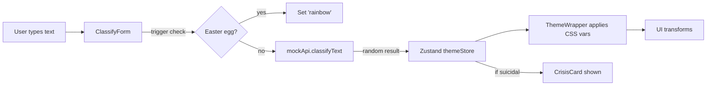

# VibeCheck — Project Blueprint

> **Mental health sentiment classifier for students** — an NLP-powered web app that dynamically reshapes its entire UI based on detected emotional states.

---

## 🧠 Project Overview

VibeCheck takes user-submitted text, classifies it into a mental health category (e.g. anxiety, depression, bipolar, stress, suicidal ideation, personality disorder), and applies a **full-spectrum visual theme transformation** to the interface. Each classification has a unique dark/light palette, animation style, and overlay effect, creating an immersive experience that reflects the detected emotional state.

When suicidal ideation is detected, the app displays crisis support resources and helpline numbers.

---

## 🏗️ Architecture

```
VibeCheck/
├── app/                    # Next.js App Router
│   ├── layout.tsx          # Root layout: Google Font (Space Grotesk), ThemeWrapper, Navbar
│   ├── page.tsx            # Home page: text input form, animated heading, crisis card
│   ├── globals.css         # CSS variables, keyframe animations, theme transitions
│   └── about/
│       └── page.tsx        # About page: team, supervisors, disclaimer
│
├── components/
│   ├── ClassifyForm.tsx    # Textarea + submit button with per-theme animations
│   ├── ThemeWrapper.tsx    # Applies CSS variables + overlays (rainbow, bipolar, PD, etc.)
│   ├── Navbar.tsx          # Fixed top nav with dark mode toggle
│   ├── CrisisCard.tsx      # Crisis intervention card (helplines, support links)
│   ├── BipolarBackground.tsx   # Split-screen animated purple/orange background
│   └── ShatteredGlassOverlay.tsx  # SVG cracked-glass overlay for personality disorder
│
├── lib/
│   ├── mockApi.ts          # Simulated classifier (random classification with delay)
│   └── themes.ts           # Theme variable definitions for all classifications × dark/light
│
├── store/
│   └── themeStore.ts       # Zustand store: classification state, dark mode, loading
│
├── tailwind.config.ts      # Tailwind with CSS variable-based custom colors
├── tsconfig.json           # TypeScript strict mode, bundler module resolution
├── next.config.js          # Next.js config (currently empty)
├── postcss.config.js       # PostCSS with Tailwind + Autoprefixer
├── .eslintrc.json          # next/core-web-vitals + exhaustive-deps warning
└── package.json            # Dependencies and scripts
```

---

## 🛠️ Tech Stack

| Category       | Technology                 |
| -------------- | -------------------------- |
| Framework      | **Next.js 14** (App Router) |
| Language       | **TypeScript** (strict)     |
| Styling        | **Tailwind CSS 3** + CSS Variables |
| Animations     | **Framer Motion 11**        |
| State          | **Zustand 4** (persisted dark mode) |
| Font           | **Space Grotesk** (Google Fonts) |
| Utilities      | **clsx** (conditional classnames) |

---

## 🎭 Classification Themes

Each classification gets a unique visual identity:

| Classification        | Visual Effect                                                         |
| --------------------- | --------------------------------------------------------------------- |
| **Normal**            | Clean dark/light neutral palette                                      |
| **Anxiety**           | Orange tones, jittering/shaking animations on text and form           |
| **Stress**            | Dark red tones, extra bold (800) font weight, tight letter spacing    |
| **Depression**        | Muted purple-gray, slow sinking animations, light font weight (300)  |
| **Bipolar**           | Split-screen purple/orange background, alternating opacity panels     |
| **Personality Disorder** | Shifting color palettes, shattered glass SVG overlay, misaligned panels |
| **Suicidal**          | Muted rose tones, crisis card with helpline resources appears         |
| **Rainbow** (easter egg) | Strobing rainbow background, bold "ALERT" overlay                 |

---

## 🔄 Data Flow



---

## 📂 Core Files & Responsibilities

### State Management — `store/themeStore.ts`
- **Zustand** store with `persist` middleware (persists `isDarkMode` to localStorage)
- Exports `Classification` union type (canonical source)
- Tracks: `classification`, `isDarkMode`, `isLoading`

### Theme Engine — `lib/themes.ts`
- Maps each classification to dark & light `ThemeVars` (CSS custom properties)
- `getThemeVars(classification, isDarkMode)` returns the active set
- Imports `Classification` from `themeStore.ts`

### Mock Classifier — `lib/mockApi.ts`
- Simulates API call with 1.2s delay
- Returns a **random** classification from the list
- Has its own `Classification` type (⚠️ duplicate — see Issues)

### Theme Application — `components/ThemeWrapper.tsx`
- Applies CSS variables as inline styles to the root wrapper
- Conditionally renders overlays: `BipolarBackground`, `ShatteredGlassOverlay`, `RainbowOverlay`
- Applies whole-page animations for anxiety (jitter) and depression (sink)
- Manages `PersonalityDisorderEffect` with cycling color palettes

### Form — `components/ClassifyForm.tsx`
- Controlled textarea with submit handler
- Easter egg detection via regex patterns
- Per-theme micro-animations on the textarea and button
- Loading state with animated dots

---

## 🎨 CSS & Animation Strategy

- **CSS Variables** on `:root` as a bridge between Tailwind and dynamic JS themes
- **Tailwind** for layout utilities; CSS variables for colors (`theme-bg`, `theme-text`, etc.)
- **Keyframes** in `globals.css`: `jitter`, `slow-sink`, `rainbow-bg`, `strobe`, `pd-color-shift`
- **Framer Motion** for component-level animations (hover, tap, enter/exit, continuous motion)
- **Transition speed** varies by theme (`0.1s` for rainbow → `1.2s` for depression)

---

## 🚀 Scripts

| Command         | Description                        |
| --------------- | ---------------------------------- |
| `npm run dev`   | Start Next.js dev server           |
| `npm run build` | Create production build            |
| `npm run start` | Serve production build             |
| `npm run lint`  | Run ESLint                         |

---

## 🗺️ Future Development Roadmap

### Phase 1 — Real ML Integration
- Replace `mockApi.ts` with actual NLP model API endpoint
- Fine-tune a transformer model (e.g. BERT / DistilBERT) on mental health text datasets
- Add confidence scores to classifications

### Phase 2 — UX Improvements
- Add `not-found.tsx` custom 404 page
- Add a "reset" button to return to normal theme
- Add loading skeleton during classification
- Add input history / session log
- Improve accessibility (ARIA labels, keyboard navigation, reduced motion)

### Phase 3 — Backend & Data
- Set up backend API (Node.js / FastAPI)
- Add user accounts & session tracking
- Store classification history for analytics
- Implement rate limiting and input sanitization

### Phase 4 — Testing & Quality
- Add unit tests (Jest / Vitest)
- Add E2E tests (Playwright / Cypress)
- Set up CI/CD pipeline
- Add ESLint as a project dependency

---

## 👥 Team

| Member                   | Role     |
| ------------------------ | -------- |
| Fatma Al-Zahraa Emad     | Student  |
| Gehad Mohamed            | Student  |
| Hebatullah El Gazoly     | Student  |
| Hussein Ibrahim          | Student  |
| Mohamed Assem            | Student  |

### Supervision
- **Dr. Lamees Nasser** — Assistant Professor
- **Eng. Mirna** — Teaching Assistant

---

## ⚠️ Known Issues

See the project review section below for a detailed list of current issues found during codebase audit.

---

## 📋 Current Issues (Audit Results)

### 🔴 Build-Breaking

1. **Build fails — `/_not-found` module missing**
   - `next build` throws `PageNotFoundError: Cannot find module for page: /_not-found`
   - **Fix**: Add an `app/not-found.tsx` file

2. **ESLint not installed**
   - `.eslintrc.json` exists but `eslint` is not in `package.json` dependencies
   - Build warns: `ESLint must be installed in order to run during builds`
   - **Fix**: `npm install --save-dev eslint`

### 🟡 Code Quality

3. **Duplicate `Classification` type**
   - Defined in **both** `lib/mockApi.ts` and `store/themeStore.ts`
   - `mockApi.ts` excludes `"rainbow"`, `themeStore.ts` includes it
   - `ClassifyForm.tsx` casts with `as Classification` to bridge the mismatch
   - **Fix**: Remove the duplicate from `mockApi.ts`, import from `themeStore.ts`

4. **`pd-color-shift` keyframe is a no-op**
   - Defined in `globals.css` (lines 137-144): animates from `--pd-bg` to `--pd-bg` (same value)
   - Not referenced anywhere in the codebase
   - **Fix**: Remove the dead keyframe

5. **Redundant ternary in `ClassifyForm.tsx`**
   - Line 59: both branches of the ternary return `"var(--bg-primary)"`
   - **Fix**: Simplify to `color: "var(--bg-primary)"`

6. **`palettes` array recreated every render in `PersonalityDisorderEffect`**
   - The `palettes` array in `ThemeWrapper.tsx` is defined inside the component body but used in a `useEffect` with `[]` dependency array
   - Not a bug (the effect closes over the initial value), but will trigger ESLint `exhaustive-deps` warnings
   - **Fix**: Move `palettes` outside the component or wrap in `useMemo`

7. **Missing `package-lock.json`**
   - No lock file committed — dependency versions are not reproducible
   - **Fix**: Commit `package-lock.json` after running `npm install`

### 🟢 Minor / Nice-to-Have

8. **Placeholder LinkedIn links**
   - All team members in `about/page.tsx` have `linkedin: "#"` — links go nowhere
   - **Fix**: Add real LinkedIn profile URLs

9. **`clsx` installed but not used anywhere**
   - Listed in `package.json` dependencies but zero imports across the codebase
   - **Fix**: Either use it (replace manual classname concatenation) or remove it

10. **`punycode` deprecation warning during build**
    - Node.js warns about the built-in `punycode` module — comes from Next.js 14 internals
    - Not actionable on this project; resolves by upgrading to newer Next.js

11. **No tests**
    - No test files, test runner, or test configuration in the project
    - **Fix**: Set up Vitest or Jest

12. **No `README.md`**
    - The project has no documentation file
    - **Fix**: This `gemini.md` can serve as a starting point
